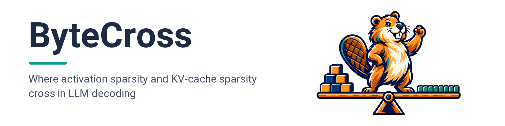
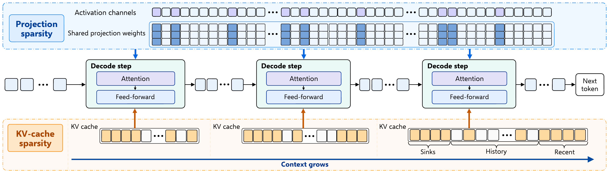
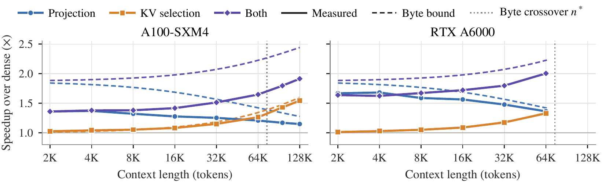

<p align="center">
  
</p>

<div align="center">

[](https://arxiv.org/abs/2609.33889)
[](LICENSE)
[](https://creativecommons.org/licenses/by/4.0/)
[](https://www.python.org/)
[](https://github.com/js-lee-AI/ByteCross/actions/workflows/ci.yml)
[](https://github.com/js-lee-AI/bytecross/stargazers)

<b><a href="#quick-start">Quick start</a> · <a href="#usage">Usage</a> · <a href="#command-line">CLI</a> · <a href="#results">Results</a> · <a href="#reproduce-the-paper">Reproduce</a> · <a href="#faq">FAQ</a> · <a href="#citation">Citation</a></b>

</div>

---

## News

- **[2026-09-28]** Code released, with the byte account, the timing and quality harness, and a script for each paper table.

## Overview

At each step, decoding one sequence rereads the projection weights, whose traffic is fixed, and the key-value (KV) cache, whose traffic grows with context. Activation sparsity trims the first term and KV-cache sparsity the second, yet their reported speedups are hard to compare because each depends on context length and on the dense attention kernel it is measured against.

ByteCross rests on three ideas.

* **A crossover from dimensions alone.** Counting the bytes each branch removes gives the byte crossover n*, the context length at which the two savings are equal, together with ideal speedup bounds for each branch and for their composition.
* **One attention kernel for every mode.** Dense and sparse modes decode after a dense prefill of real text and read their caches through the same split-K attention kernel, so the dense baseline stays fixed.
* **Crossings located within 4.1K tokens.** Adding the kernel cost of each branch, measured in separate sweeps, lets the byte account predict the measured crossings of three keep-ratio pairs, a second model, and a second GPU to within 4.1K tokens.

This repository is the byte account as a small library, plus the timing and quality harness and the scripts that rebuild the paper tables.

## What it does in one picture

<p align="center">
  
</p>

<p align="center"><em>Decode-step reads of the two sparse branches as context grows. Blue marks the projection weights that the activations of each token select, and amber marks the KV entries that an attention-scored selection keeps.</em></p>

## Quick start

```bash
pip install "git+https://github.com/js-lee-AI/bytecross.git"
```

```python
import bytecross

# the fields of the Llama-3.1-8B-Instruct config.json that the byte account reads
config = {"num_hidden_layers": 32, "hidden_size": 4096, "intermediate_size": 14336, "vocab_size": 128256,
          "num_attention_heads": 32, "num_key_value_heads": 8, "max_position_embeddings": 131072}
m = bytecross.Model.from_config(config)

for rp, rkv in [(0.7, 0.3), (0.5, 0.3), (0.5, 0.5)]:
    print(f"keep {rp} / {rkv}   n* = {bytecross.crossover(m, rp, rkv) / 1024:.1f}K tokens")
print(f"KV keep 0.3 at 128K   speedup bound {bytecross.bound(m, 131072, rkv=0.3):.2f}x")
# keep 0.7 / 0.3   n* = 44.6K tokens
# keep 0.5 / 0.3   n* = 74.3K tokens
# keep 0.5 / 0.5   n* = 104.0K tokens
# KV keep 0.3 at 128K   speedup bound 1.60x
```

This runs on a CPU in well under a second and downloads nothing. The same code is [`examples/quickstart.py`](examples/quickstart.py), and CI runs it on every push. The three crossovers are the n* column of paper Table 2, and 1.60x is the byte bound of a 30% KV keep at 128K in paper Table 11.

To time decoding and measure quality on a GPU, install the `harness` extra, then flash-attn and a TEAL checkout (see [Reproduce the paper](#reproduce-the-paper)).

```bash
pip install "bytecross[harness] @ git+https://github.com/js-lee-AI/bytecross.git"
```

| install | adds | enough for |
|---|---|---|
| `pip install "git+https://github.com/js-lee-AI/bytecross.git"` | numpy | the byte account, the quickstart, the `bytecross` command, every analysis of logged runs |
| `pip install "bytecross[harness] @ git+https://github.com/js-lee-AI/bytecross.git"` | torch 2.4.0, transformers, datasets, safetensors, msgspec, scipy | the timing and quality harness, together with flash-attn 2.6.3 and TEAL |
| `git clone` and then `pip install -e ".[harness,test]"` | pytest | `experiments/` and `tests/` |

Tested with Python 3.11, PyTorch 2.4.0, CUDA 12.1 and flash-attn 2.6.3 on A100-SXM4 80 GB and RTX A6000 48 GB GPUs.

## Usage

### The byte account

```python
import bytecross

m = bytecross.MODELS["llama-3.1-8b"]      # or bytecross.Model.from_config("config.json")

print(round(bytecross.crossover(m, rp=0.5, rkv=0.3) / 1024, 1))                # 74.3
print(round(bytecross.crossover(m, rp=0.5, rkv=0.3, ff_only=True) / 1024, 1))  # 60.0
print(round(bytecross.bound(m, 32768, rp=0.5, rkv=0.2), 3))                    # 2.172
print(round(bytecross.crossover_batch(m, union_keep=0.92, rkv=0.3, batch=4) / 1024, 1))  # 3.0
```

`crossover` is Equation 5 of the paper, `ff_only=True` sparsifies only the three feed-forward projections, and `bound` is the ideal speedup `B_total / (B_total - dB)` of a step that is purely bandwidth-bound. `crossover_batch` takes the fraction of projection weights that a batch reads, here 92% at four sequences, and `crossover_fixed_budget` covers a KV method with a fixed token budget. The printed values appear in paper Tables 1 and 17 and in Section 4.4.

### The quality-matched crossover

```python
import bytecross

m = bytecross.MODELS["llama-3.1-8b"]
proj = {0.7: 0.180, 0.6: 0.402, 0.5: 0.995}             # PPL increase at 32K by projection keep
sel = {0.5: -0.007, 0.3: 0.004, 0.2: 0.004, 0.1: 0.06}  # and by KV keep
for budget in (0.2, 0.5, 1.0):
    print(budget, round(bytecross.matched_crossover(m, proj, sel, budget) / 1024, 1))
# 0.2 35.7
# 0.5 48.1
# 1.0 57.8
```

Each branch takes the lowest keep ratio whose linearly interpolated perplexity increase stays within the budget, and the two byte savings are then equated. The curves are the 32K values of paper Table 16 and Section 5.2, and the crossovers are those of Figure 6.

### Timing and quality on a GPU

```bash
export TEAL_DIR=$PWD/TEAL CKPT=checkpoints/Llama-3.1-8B-Instruct/model.pth
python -m bytecross.timing --mode both --context 32768 --projection-keep 0.5 --kv-keep 0.3 \
    --checkpoint $CKPT --output runs/cell.json
python -m bytecross.ppl --checkpoint $CKPT --settings 1.0/1.0 1.0/0.2 0.5/0.2 --output runs/ppl.json
python -m bytecross.retrieval passkey --checkpoint $CKPT --setting 1.0/0.2 --output runs/passkey.json
```

A timing cell is one mode at one context in a fresh process. It fills the cache with a dense prefill of the first n WikiText-2 test tokens, compiles the decode step with full-graph compilation, and times five repeats of 50 steps after five warm-up steps. The four modes are `dense`, `proj` (TEAL on all seven projections), `sel` (the scored selection gathered into one contiguous buffer) and `both`, and all of them read the cache through `flash_attn_with_kvcache`. A setting is `projection keep / KV keep`, and 1.0 disables a branch.

### API at a glance

| call | what it does | needs |
|---|---|---|
| `bytecross.crossover(m, rp, rkv)` | byte crossover n* in tokens (Equation 5) | base install |
| `bytecross.bound(m, n, rp, rkv)` | ideal speedup over dense decoding at context n | base install |
| `bytecross.Model.from_config(path_or_dict)` | model dimensions from a Hugging Face config | base install |
| `bytecross.matched_crossover(m, proj, sel, budget)` | crossover at equal perplexity increase | base install |
| `bytecross.campaign`, `.crossing`, `.predict`, `.composition`, `.dispatch` | analyses of logged timing and quality runs | base install |
| `bytecross.load_model`, `sparsify_projections`, `prefill`, `select_and_compact` | the harness | `[harness]`, flash-attn, TEAL |

The base install imports neither torch nor numpy. Harness names load the first time one of them is used.

## Command line

Installing the package adds a `bytecross` command, and `python -m bytecross` runs the same thing.

```bash
bytecross --help
bytecross demo                                         # the quickstart, on CPU
bytecross crossover --config config.json --rp 0.5 --rkv 0.3   # n* and bounds for any model
bytecross traffic                                      # Tables 1 and 9 and the Figure 3 bounds
bytecross campaign run experiments/specs/sweep.json --checkpoint $CKPT --out runs/sweep   # GPU
bytecross campaign summary runs/sweep                  # speedups, block intervals, byte bounds
bytecross crossing runs/crossing                       # latency crossings with block intervals
bytecross predict runs/sweep --keep runs/keep          # kernel costs and cost-aware predictions
```

Every analysis subcommand takes `--help`.

## Results

The projection branch leads at short context and the KV branch at long context, with speedups that follow their byte bounds up to fixed kernel costs.

<p align="center">
  
</p>

<p align="center"><em>Speedup over dense decoding of the projection branch, the KV selection, and both together on Llama-3.1-8B after a dense prefill of real text (paper Figure 3). Solid lines are measured, dashed lines are byte bounds, and RTX A6000 runs stop at 64K.</em></p>

### Byte crossover lengths (paper Table 1)

At 50% projection keep and 30% KV keep, for all seven projections (n*) and for the three feed-forward projections alone (n*_FF). Window is the released context length.

| model | d | d_ff | n* | n*_FF | window |
|---|---|---|---|---|---|
| Qwen3-8B | 4096 | 12288 | 65.7K | 51.4K | 40K |
| Llama-3.1-8B | 4096 | 14336 | 74.3K | 60.0K | 128K |
| Mistral-7B | 4096 | 14336 | 74.3K | 60.0K | 32K |
| Llama-3.1-70B | 8192 | 28672 | 291.4K | 240.0K | 128K |

Reproduce with `python experiments/table1_crossover.py`, on CPU with no inputs.

### Predicted and measured crossings (paper Table 2)

In K tokens. Pred. adds the kernel cost of each branch, taken from separate sweeps, to the byte account. Measured is the crossing of fresh-process blocks, five on A100-SXM4 and four on RTX A6000.

| GPU | model | r_P / r_KV | n* | Pred. | Measured |
|---|---|---|---|---|---|
| A100-SXM4 | 8B | 0.7 / 0.3 | 44.6 | 28.6 | 25.1 |
| A100-SXM4 | 8B | 0.5 / 0.3 | 74.3 | 51.9 | 50.4 |
| A100-SXM4 | 8B | 0.5 / 0.5 | 104.0 | 72.4 | 68.3 |
| A100-SXM4 | 3B | 0.5 / 0.3 | 34.3 | 13.9 | 16.5 |
| RTX A6000 | 8B | 0.7 / 0.3 | 44.6 | 38.7 | 39.3 |
| RTX A6000 | 8B | 0.5 / 0.3 | 74.3 | 68.5 | 68.7 |

Reproduce with `python experiments/table2_crossings.py`, and add `--full` for every context of paper Tables 12 and 13.

### Retrieval as an admissibility test (paper Table 3)

Perplexity increase over dense decoding at 32K and retrieval accuracy on Llama-3.1-8B-Instruct, whose dense perplexity is 6.09.

| configuration | dPPL | passkey 32K | 64K | 127K | multi-key 32K | 64K | 127K |
|---|---|---|---|---|---|---|---|
| Dense | 0 | 40/40 | 40/40 | 40/40 | 40/40 | 40/40 | 36/40 |
| KV window, 30% | 0.06 | 16/40 | 16/40 | 16/40 | 16/40 | 16/40 | 14/40 |
| Selection, 30% | <0.01 | 40/40 | 40/40 | 40/40 | 40/40 | 40/40 | 36/40 |
| Selection, 20% | <0.01 | 40/40 | 40/40 | 40/40 | 40/40 | 40/40 | 36/40 |
| Proj. 50% + sel. 20% | 0.96 | 40/40 | 40/40 | 40/40 | 40/40 | 40/40 | 36/40 |

Reproduce with `python experiments/table3_retrieval.py`, which rebuilds every row except the KV window. The window records are in `records/quality/window/` as data only.

### Composition under a perplexity budget (paper Table 4)

Fastest configuration within each perplexity budget at 32K on RTX A6000, timed in five independent blocks. A keep ratio of 1 disables a branch.

| budget | r_P / r_KV | dPPL | speedup over dense | over best single |
|---|---|---|---|---|
| 0.1 | 1.0 / 0.2 | 0.004 | 1.20x | 1.00x |
| 0.2 | 0.7 / 0.2 | 0.146 | 1.53x | 1.25x |
| 0.5 | 0.6 / 0.2 | 0.402 | 1.69x | 1.26x |
| 1.0 | 0.5 / 0.2 | 0.963 | 1.86x | 1.25x |

On A100 the same compositions lead the best single branch by 14 to 24%. Reproduce with `python experiments/table4_composition.py`, which also prints paper Tables 16 and 17 for both GPUs.

### Dispatch on a request mix (paper Table 5)

Decode speedup over dense decoding of each dispatch policy on a mix of chat, long-document questions and agent loops. Requests that use the selection also pay for its scoring pass.

| policy | A100-SXM4 | RTX A6000 |
|---|---|---|
| Always projection | 1.270 | 1.518 |
| Always KV selection | 1.088 | 1.101 |
| Always both | 1.401 | 1.694 |
| Calibrated gate | 1.404 | 1.716 |

Reproduce with `python experiments/table5_dispatch.py`.

## Reproduce the paper

```bash
git clone https://github.com/js-lee-AI/bytecross.git
cd bytecross
pip install -e ".[harness,test]"
```

The measurements behind the tables and figures are in `records/`, and [records/README.md](records/README.md) lists the paper table or figure that each folder backs. The campaign and quality records use the format the harness writes, one JSON file per timing cell and one per quality run. A timing record holds the mode, the context, both keep ratios, the step time in ms and the throughput, the model and GPU, and the block, group and cell it belongs to. Every script below reads these records and prints the rows it rebuilds, on a CPU in a few seconds. The window baseline of Figure 5 and Tables 3, 10 and 11 and the measurements of Tables 6 to 8, 14 and 15 are included as data that no script here rebuilds.

| paper | command |
|---|---|
| Table 1, Section 3 | `python experiments/table1_crossover.py` |
| Table 9 | `python experiments/table9_qwen3_traffic.py` |
| Figure 3, Table 10 | `python experiments/figure3_context_sweep.py` |
| Table 2, Tables 12 and 13 | `python experiments/table2_crossings.py --full` |
| Table 3 | `python experiments/table3_retrieval.py` |
| Figure 6 | `python experiments/figure6_quality_matched.py` |
| Table 4, Tables 16 and 17 | `python experiments/table4_composition.py` |
| Table 5 | `python experiments/table5_dispatch.py` |

To collect new records, set up the harness first. TEAL supplies the projection branch and its gpt-fast decoding loop, and its Llama-3-8B threshold histograms are the default.

```bash
pip install flash-attn==2.6.3 --no-build-isolation
git clone https://github.com/FasterDecoding/TEAL
git -C TEAL checkout fb7373c93ac3594817c9ee64d4e08b47430a1822
export TEAL_DIR=$PWD/TEAL

huggingface-cli download meta-llama/Llama-3.1-8B-Instruct --local-dir hf/Llama-3.1-8B-Instruct
python -m bytecross.convert --source hf/Llama-3.1-8B-Instruct --dest checkpoints/Llama-3.1-8B-Instruct
export CKPT=checkpoints/Llama-3.1-8B-Instruct/model.pth
```

Llama-3.2-3B-Instruct converts the same way. WikiText-2 (`wikitext-2-raw-v1`, test split) loads through `datasets`. Each campaign in `experiments/specs/` runs every cell in fresh processes, block by block, and resumes where it stopped.

| records | command | hardware |
|---|---|---|
| context sweeps | `bytecross campaign run experiments/specs/sweep.json --checkpoint $CKPT --out records/sweep_a100` | 1x A100-SXM4 80 GB |
| | the same with `--max-context 65536 --out records/sweep_a6000` | 1x RTX A6000 48 GB |
| 32K keep-ratio campaign | `bytecross campaign run experiments/specs/keep_32k.json --checkpoint $CKPT --out records/keep_a100` | 1x A100-SXM4 80 GB |
| crossing campaigns | `experiments/specs/crossing_a100.json`, `crossing_a6000.json`, `crossing_3b.json` | A100-SXM4 and RTX A6000 |
| Llama-3.2-3B sweep | `experiments/specs/sweep_3b.json` | 1x A100-SXM4 80 GB |
| composition screen and re-timing | `experiments/specs/composition_screen.json`, `composition_retime.json` | RTX A6000, and A100-SXM4 for the re-timing |
| perplexity | `python -m bytecross.ppl --checkpoint $CKPT --settings 1.0/1.0 1.0/0.2 0.5/0.2 --output records/quality/grid_ppl.json` | 1 GPU |
| retrieval | `python -m bytecross.retrieval passkey --checkpoint $CKPT --setting 1.0/0.2 --output records/quality/retrieval/passkey_sel20.json` | 1 GPU |

From 64K on, `ppl` and `retrieval` take `--contexts 65536 130048 --flash-prefill`, which replaces the dense causal mask of gpt-fast with FlashAttention prefill and a mask built row by row.

A few conventions decide the printed numbers. Speedups are paired ratios to the dense cell of the same block. Timing intervals enumerate all block resamples, 3,125 for five blocks and 256 for four, and a crossing interpolates the mean difference linearly between the last context where the projection branch leads and the first where the selection leads. Quality intervals resample the eight paired windows 20,000 times, and the three projection-only rows of Table 16 use a bootstrap with their own seed, which `experiments/table4_composition.py` passes as `--projection-seed`. In Table 17 and Section 5.3, the gain of a composition over its single-branch comparator is the ratio of their mean speedups.

## Repository layout

```
bytecross/traffic.py       the byte account (Equations 1 to 5), bounds, quality-matched crossover
bytecross/campaign.py      timing campaigns in blocks and the block-resampling statistics
bytecross/crossing.py      measured latency crossings with intervals
bytecross/predict.py       kernel costs and cost-aware crossing predictions
bytecross/composition.py   composition under a perplexity budget
bytecross/dispatch.py      dispatch policies priced on request mixes
bytecross/harness.py       model loading, TEAL projection sparsity, split-K decode attention, prefill
bytecross/kvselect.py      the attention-scored selection and its compact buffer
bytecross/timing.py        one timing cell
bytecross/ppl.py           decode-position perplexity
bytecross/retrieval.py     passkey and multi-key retrieval
bytecross/convert.py       Hugging Face to gpt-fast checkpoint conversion
bytecross/cli.py           the bytecross command
examples/quickstart.py     the CPU demo shown above
experiments/               one script per paper table or figure, and the campaign specs
records/                   the measurements behind the paper, listed in records/README.md
tests/                     fast CPU tests that CI runs
```

## FAQ

<details>
<summary><b>Do I need a GPU?</b></summary>

Only to collect new records. The byte account, the `bytecross` command and every analysis of logged records run on a CPU with the base install. Timing and quality runs need a CUDA GPU, the `harness` extra, flash-attn 2.6.3 and a TEAL checkout.

</details>

<details>
<summary><b>Which models does the byte account cover?</b></summary>

Any decoder whose number of query heads times the head dimension equals the hidden size, read from its `config.json` with `Model.from_config` or `bytecross crossover --config`. The harness registers Llama-3.1-8B-Instruct and Llama-3.2-3B-Instruct, the two models the paper times.

</details>

<details>
<summary><b>A KV method reports a speedup above its byte bound. Is it better?</b></summary>

No. A gain above the byte bound indicates wasted execution in the dense baseline. At 128K the same KV window runs 6.92x faster than dense decoding with masked attention and 1.29x faster with split-K attention, below its byte bound of 1.60x (paper Section 4.4). This is why every mode here reads its cache through the same split-K kernel.

</details>

<details>
<summary><b>Why do my numbers differ from the paper?</b></summary>

The byte crossover and the bounds have no fitted parameter, so they match to the digit. Step times depend on the GPU, the driver and compilation, which is why every speedup is paired with a dense cell of the same block and every interval resamples whole blocks. The kernel costs that move a latency crossing away from n* are about 2 ms per step for the sparse projection on A100 and 1 to 1.5 ms on RTX A6000, so a different GPU moves the crossings.

</details>

<details>
<summary><b>How is this different from TEAL and SnapKV?</b></summary>

It does not propose a new sparsifier. The projection branch runs TEAL unchanged, and the KV branch follows SnapKV with a selection made once after prefill. What this repository adds is the byte account that says where the two branches cross and the timing protocol that measures it.

</details>

## Citation

If you use this code, please cite the paper.

```bibtex
@article{lee2026sparsitycross,
  title   = {Where Activation Sparsity and KV-Cache Sparsity Cross in LLM Decoding},
  author  = {Lee, Jungseob and Lee, Seungyoon and Hong, Seongtae and Eo, Sugyeong and Lim, Heuiseok},
  journal = {arXiv preprint arXiv:2609.33889},
  year    = {2026},
  url     = {https://arxiv.org/abs/2609.33889}
}
```

The Cite this repository button in the GitHub sidebar gives the same entry from [`CITATION.cff`](CITATION.cff).

## License

Code is MIT, see [LICENSE](LICENSE). The paper is CC BY 4.0.

## Acknowledgments

The projection branch uses [TEAL](https://github.com/FasterDecoding/TEAL) and its gpt-fast decoding loop, every mode reads its cache through `flash_attn_with_kvcache` from [FlashAttention](https://github.com/Dao-AILab/flash-attention), and the KV selection follows [SnapKV](https://github.com/FasterDecoding/SnapKV).
